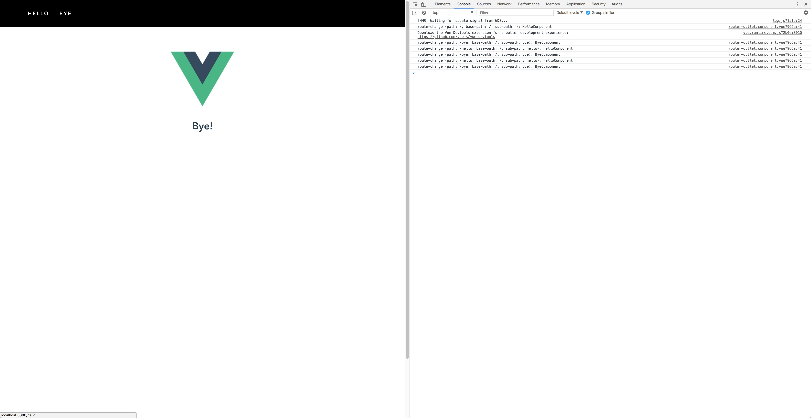

Vue Dependency Injection
===
## TL;DR
Vue allows us to use [dependency injection][9] using the `provide` and `inject` properties. 

Using this, resources provided by an ancestor component in the component tree are accessible by any descendent component using a string or symbol identifier.  

This dependency injection pattern using `provide`/`inject` may replace `Vue.use()` for suitable resources. This repo demonstrates this for a simple router.

## About
### Project Dependencies
The project depends on the following packages 
+ [vue-class-component][1],
+ [vue-property-decorator][2] and
+ [vue-rx][10] (+ [vue-compat][11])
+ [@babel/plugin-proposal-class-properties][6]

The first two packages allow us to write Vue components using ES5 class syntax leveraging decorators for compactness and clarity. E.g. we can write
```javascript
// ancestor component
export default class Ancestor extends Vue {
    // ...
    @Provide(RESOURCE) resource = resource;
    // ...
}

// descendant component
export default class Descendant extends Vue {
    // ...
    @Inject(RESOURCE) resource;
    // ...
}
```
instead of 
```javascript
// ancestor component
export default {
    // ...
    provide: {
        [RESOURCE]: resource
    },
    // ...
}

// descendant component
export default {
    // ...
    inject: {
        resource: RESOURCE
    },
    // ...
}
```
 **Rx** was be used to create a route change observable. 

### App Structure
#### App Component
`AppComponent` provides a simple router component using the `@Provide` decorator. The symbol `ROUTER` uniquely identifies the router dependency.
```javascript
export default class App extends Vue {

  // Make the router service injectable in descendant components.
  @Provide(ROUTER) router = router;
 
  /* ... */

}
```
The app view consists of a simple navigation bar and a content box. 
```html
<div id="app">
    <nav>
      <ul>
        <li><router-link to="/hello">hello</router-link></li>
        <li><router-link to="/bye">bye</router-link></li>
        </ul>
    </nav>
    <main>
      <router-outlet basePath="/" :routerTable="routerTable">
        Loading...
      </router-outlet>
    </main>
  </div>
```

In the navigation bar `RouterLinkComponent` (selected by `router-link`) is used to trigger navigation changes on click. The content box contains a `RouterOutletComponent` (selected by `router-outlet`) which dynamically renders components using Vue's `<component>`. A router table is passed to the outlet (binding `:routerTable="routerTable"`, content see below) 
```javascript
{
    'hello': HelloComponent
    , 'bye': ByeComponent
    , '': HelloComponent
}
```
which lets the router outlet register itself with the router on creation
```js
export default class RouterOutletComponent extends Vue {

    @Inject(ROUTER) router;
    /* ... */
    @Prop(Object) routerTable;

    /* ... */

    created() {
        this.router.register(this.basePath, this.routerTable);
        this.routeChangesSubscription = this.router.routeChanges.subscribe(this.routeChanged);
    }

    /* ... */

}
```

Route change events are broadcasted by the router using the `routeChanges` observable. `RouterOutletComponent` subscribes to this and updates its `activeComponent` property for route changes matching its `basePath` property exactly.
```javascript
export default class RouterOutletComponent extends Vue {

    /* ... */

    @Prop(String) basePath;
    
    /* ... */

    activeComponent = null;
    
    /* ... */

    routeChanged({path, basePath, subPath, component}) {
        // Ignore route changes not meant for this outlet.
        if (basePath === this.basePath) {
            console.info(`route-change (path: ${path}, base-path: ${basePath}, sub-path: ${subPath}): ${component.name}Component`);
            this.activeComponent = component;
        }
    }
}
```

#### Router
A minimal router was implemented using Vue's `<component>` for dynamic component creation. The router is injected into both the `RouterLinkComponent` and `RouterOutletComponent` instances using the symbol `ROUTER`. 

The basic event flow is as follows:

1. A `RouterLinkComponent` instance handles a click event by calling `navigateTo` on the injected router 
```javascript
export default class RouterLinkComponent extends Vue {

    /* ... */

    @Inject(ROUTER) router;

    clicked() {
        // Tell the router to navigate to the path passed via the "to" props.
        this.router.navigateTo(this.to);
    }    

}
```
2. The injected router resolves the component and if successful emits an event using `routeChanges`
3. All `RouterOutletComponent` instances receive the route change event and conditionally rerender their component (see method `routeChanged` above)

## Installation
1. Clone this repository
2. Start the server
    ```bash
    npm run serve
    ```

You should see the vue logo and a message "Hello there!" or "Bye!" depending on which link you clicked. The console log will contain additional information about the matched path, sub path and component.
> **EXAMPLE:**
> 
---

[1]: https://github.com/vuejs/vue-class-component
[2]: https://github.com/kaorun343/vue-property-decorator
[3]: https://github.com/loganfsmyth/babel-plugin-transform-decorators-legacy
[4]: https://github.com/vuejs/vue-router
[5]: https://github.com/babel/babel/issues/7831
[6]: https://github.com/babel/babel/tree/master/packages/babel-plugin-proposal-class-properties
[7]: https://github.com/vuejs/vue-cli
[8]: https://nodejs.org/en/download/
[9]: https://vuejs.org/v2/api/#provide-inject
[10]: https://github.com/vuejs/vue-rx
[11]: https://github.com/ReactiveX/rxjs/tree/master/compat